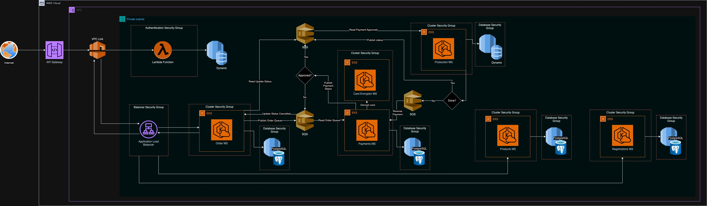

# Tech Challenge - Grupo 19

O **Tech Challenge** é um projeto de um sistema de autoatendimento de fast food, que é composto por uma série de dispositivos e interfaces que permitem aos clientes selecionar e fazer pedidos sem precisar interagir com um atendente.


## Integrantes

- [@filipedev040990](https://www.github.com/filipedev040990) - Filipe Siqueira
- [@repRSilva](https://www.github.com/repRSilva) - Rafael Silva
- [@rodrigodos-santos](https://www.github.com/rodrigodos-santos) - Rodrigo dos Santos
- [@me-marchi](https://www.github.com/me-marchi) - Maria Eduarda Marchi
- [@vanessalimaf](https://www.github.com/vanessalimaf) - Vanessa Lima

## Repositórios Relacionados

Este projeto faz parte de um ecossistema maior de repositórios. Aqui está a lista de repositórios relacionados:

1. **[Repositório de Infraestrutura](https://github.com/FIAP-SOAT-G19/tech-challenge-iac)** - Contém o código-fonte relacionado a construção de toda a infra da aplicação com Terraform.
2. **[Repositório de Autenticação](https://github.com/FIAP-SOAT-G19/lambda)** - Código-fonte relacionado a autenticação da aplicação com lambda.
3. **[Repositório de Produtos](https://github.com/FIAP-SOAT-G19/products-microservice)** - Código-fonte relacionado ao catálogo de produtos.
4. **[Repositório de Cadastros](https://github.com/FIAP-SOAT-G19/registrations-microservice)** - Código-fonte relacionado ao cadastro de funcionários e clientes.
5. **[Repositório de Pedidos](https://github.com/FIAP-SOAT-G19/order-microsservice)** - Código-fonte relacionado ao pedido.
6. **[Repositório de Pagamentos](https://github.com/FIAP-SOAT-G19/payments-microsservice)** - Código-fonte relacionado ao processamento de pagamentos, este microserviço está relacionado ao microserviço que faz o decrypt dos dados do cartão de crédito.
7. **[Repositório Encryptor](https://github.com/FIAP-SOAT-G19/card-encryptor-microsservice)** - Código-fonte utilizado para encryptar e desencryptar dados dos cartões de crédito.
8. **[Repositório de Produção](https://github.com/FIAP-SOAT-G19/production-microservice)** - Código-fonte relacionado a produção dos pedidos.


## Sumário
1. [Instruções para Rodar a Aplicação](#instruções-para-rodar-a-aplicação)
2. [Justificativa do Padrão SAGA](#justificativa-do-padrão-saga)
3. [Relatórios OWASP ZAP](#relatórios-owasp-zap)
4. [Relatório RIPD](#relatório-ripd)
5. [Desenho da Arquitetura](#desenho-da-arquitetura)
6. [Vídeo Explicativo](#vídeo-explicativo)

## Instruções para Rodar a Aplicação
- Execute os seguintes comandos:
  ```bash
    kubectl apply -f k8s/db-deployment.yaml
    kubectl apply -f k8s/api-products-deployment.yaml
    kubectl apply -f k8s/metrics.yaml
  ```

- Utilize os comandos abaixo para encaminhar as conexões das portas locais para a portas dos pod's Kubernetes (o segundo comando é opcional)
  ```bash
    kubectl port-forward service/api-svc 3000:3000 &
    kubectl port-forward service/database-svc 5432:5432 &
  ```

## Justificativa do Padrão SAGA

Foi escolhido o padrão SAGA sem um orquestrador devido às seguintes razões:
- **Simplicidade:** A implementação direta do padrão SAGA sem um orquestrador reduz a complexidade e facilita a manutenção do código.
- **Desempenho:** Sem um orquestrador intermediário, as comunicações entre serviços podem ser mais rápidas e eficientes.
- **Flexibilidade:** Permite maior flexibilidade na implementação das transações, adaptando-se melhor às necessidades específicas do projeto.

## Relatórios OWASP ZAP

Os relatórios de segurança gerados pelo OWASP ZAP estão disponíveis nos links abaixo:

- Produtos
  - [Relatório antes das correções](./assets/reports/products/before-product-ms.html)
  - [Relatório após as correções](./assets/reports/products/after-product-ms.html)

- Produção
  - [Relatório antes das correções](./assets/reports/production/2024-06-21-ZAP-Report-localhost.html)
  - [Relatório após as correções](./assets/reports/production/after-production-ms.html)

- Pagamentos
  - [Link Discord](https://discord.com/channels/1065992165232214066/1257387783123767317) - Postamos essa dúvida: Temos um micro serviço que executa como um worker, ele pluga em uma fila sqs e processa a partir disso. Pelas aulas vimos que o OWASP ZAP, é executa a partir de rotas HTTP. Recebemos o retorno: pela definição o OWASP ZAP é um web scanner.Não existe outra alternativa, não precisa efetuar os testes nesse ponto específico.

## Relatório RIPD

O Relatório de Impacto de Proteção de Dados (RIPD) pode ser acessado no link a seguir:
- [Relatório RIPD](./assets/reports/RIPD-Grp19.pdf)

## Desenho da Arquitetura


## Vídeo Explicativo

Assista ao vídeo explicativo do projeto clicando [aqui](https://link-para-o-video-explicativo).
