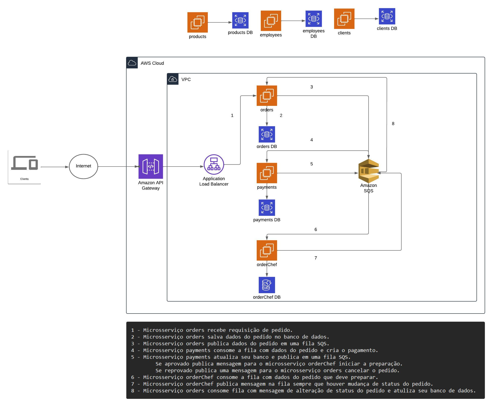
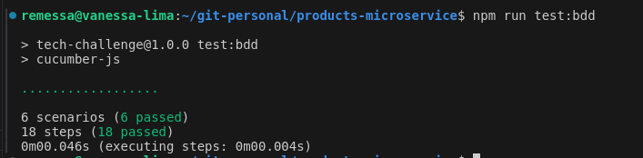

# 💬 Tech Challenge

## ✳️ Sobre
O **Tech Challenge** é um projeto de um sistema de autoatendimento de fast food, que é composto por uma série de dispositivos e interfaces que permitem aos clientes selecionar e fazer pedidos sem precisar interagir com um atendente.

---

## 🛠 Ferramentas Utilizadas
- [Node](https://nodejs.dev)
- [Express](https://expressjs.com/pt-br/)
- [PostgreSQL](https://www.postgresql.org/)
- [Prisma](https://www.prisma.io/)
- [Jest](https://jestjs.io)
- [k8s](https://kubernetes.io/pt-br/)
---

## 💻 Clonando o repositório

- Clone o projeto

  ```bash
  git clone https://github.com/FIAP-SOAT-G19/products-microservice.git
  ````
---

## 🏠 Adicionando variáveis de ambiente (.env)
Existe o arquivo `.env.example` com todas as variáveis utilizadas para rodar o sistema. Faça uma cópia desse arquivo e renomeie a cópia para `.env` antes de executar o comando para iniciar a aplicação.
---

## Arquitetura do projeto


<<<<<<< HEAD
## Sumário
1. [Instruções para Rodar a Aplicação](#instruções-para-rodar-a-aplicação)
2. [Justificativa do Padrão SAGA](#justificativa-do-padrão-saga)
3. [Relatórios OWASP ZAP](#relatórios-owasp-zap)
4. [Relatório RIPD](#relatório-ripd)
5. [Desenho da Arquitetura](#desenho-da-arquitetura)
6. [Vídeo Explicativo](#vídeo-explicativo)

## Instruções para Rodar a Aplicação
=======

## Justificativa do Padrão SAGA Coreografada
<details>
  <summary>Justificativa do Padrão SAGA coreografa</summary>
  Escolhemos o padrão Saga Coreografada para o desenvolvimento do Tech-Challenge, por termos como requisito ser uma aplicação distribuída com arquitetura de microserviços, a saga coreografada nos ajuda a resolver alguns paradigmas no desenvolvimento desses microserviços distribuídos. As principais vantagens que temos com a utilização da saga coreografada são:
  1.	Desacoplamento e Autonomia dos Serviços:
  o	Desacoplamento: Cada serviço decide de forma independente quando e como realizar suas operações. Isso leva a um baixo acoplamento entre os serviços.
  o	Autonomia: Os serviços não dependem de um orquestrador central para controlar o fluxo da saga, aumentando a resiliência e escalabilidade do sistema.
  2.	Escalabilidade e Resiliência:
  o	Escalabilidade: Como os serviços comunicam-se de forma assíncrona, o sistema pode lidar melhor com picos de carga, já que não há uma necessidade imediata de coordenação central.
  o	Resiliência: A ausência de um ponto central de falha (como um orquestrador) significa que uma falha em um serviço específico não necessariamente afeta todo o sistema.
  3.	Flexibilidade e Evolução Independente:
  o	Flexibilidade: Serviços podem ser modificados, adicionados ou removidos sem impacto significativo nos outros, facilitando a evolução do sistema.
  o	Evolução Independente: Permite que equipes diferentes desenvolvam e implantem serviços de forma independente, promovendo a agilidade no desenvolvimento.
  4.	Desempenho:
  o	Desempenho Assíncrono: A comunicação assíncrona evita o bloqueio dos serviços durante a execução das sagas, o que pode melhorar o desempenho geral do sistema.
  5.	Facilidade na Implementação de Compensações:
  o	Compensações Simples: Cada serviço gerencia suas próprias transações e compensações, simplificando a implementação e o gerenciamento dos fluxos compensatórios.
  A partir desses pontos relevantes em que baseamos nossa decisão pela utilização da saga coreografada, mas como tudo não são flores têm alguns pontos negativos em relação a essa escolha também, são as desvantagens a seguir:
  1.	Complexidade na Coordenação de Eventos: A comunicação baseada em eventos pode introduzir complexidade na coordenação e na garantia da consistência eventual.
  2.	Observabilidade: Monitorar e depurar um sistema coreografado pode ser mais desafiador devido à natureza distribuída e assíncrona das transações.
  3.	Desempenho em Cenários de Alto Volume de Transações: É necessário garantir que o sistema de mensageria suporte o volume de eventos gerados pelas sagas.
  Conclusão
  A escolha do padrão de saga coreografada para a arquitetura de microserviços é justificada pela necessidade de um sistema desacoplado, escalável e resiliente. Embora existam desafios a serem superados, as vantagens em termos de autonomia dos serviços, flexibilidade no desenvolvimento e escalabilidade fazem deste padrão uma escolha adequada para garantir a consistência de dados em sistemas distribuídos complexos.
</details>

## 🧪 Testes:
- Evidência cobertura de testes unitários

  ```bash
  npm run test:coverage
  ```

- Evidência teste BDD

  ```bash
  npm run test:bdd
  ```
---

## ▶️ Executando o projeto localmente no kubernetes
>>>>>>> 57fd9e66f8869061e110a3f06a411bf2a498e565
- Execute os seguintes comandos:
  ```bash
    kubectl apply -f k8s/db-deployment.yaml
    kubectl apply -f k8s/api-deployment.yaml
    kubectl apply -f k8s/metrics.yaml
  ```

- Utilize os comandos abaixo para encaminhar as conexões das portas locais para a portas dos pod's Kubernetes (o segundo comando é opcional)
  ```bash
    kubectl port-forward service/api-svc 3000:3000 &
    kubectl port-forward service/database-svc 5432:5432 &
  ```

- O Backend iniciará em [http://localhost:3000](http://localhost:3000)

<<<<<<< HEAD
Foi escolhido o padrão SAGA sem um orquestrador devido às seguintes razões:
- **Simplicidade:** A implementação direta do padrão SAGA sem um orquestrador reduz a complexidade e facilita a manutenção do código.
- **Desempenho:** Sem um orquestrador intermediário, as comunicações entre serviços podem ser mais rápidas e eficientes.
- **Flexibilidade:** Permite maior flexibilidade na implementação das transações, adaptando-se melhor às necessidades específicas do projeto
=======

## ▶️ Executando o projeto na Amazon AWS
- Execute primeiro o repositório com a infraestrutura
  - [Repositório Infra](https://github.com/FIAP-SOAT-G19/tech-challenge-iac)
- Agora com a infraestrutura montada, executa cada repositório abaixo
  - [Repositório Produtos](https://github.com/FIAP-SOAT-G19/products-microservice)
  - [Repositório Produção](https://github.com/FIAP-SOAT-G19/production-microservice)
  - [Repositório Pagamentos](https://github.com/FIAP-SOAT-G19/payments-microsservice)
  - [Repositório Pedidos](https://github.com/FIAP-SOAT-G19/order-microsservice)
  - [Repositório Cadastro](https://github.com/FIAP-SOAT-G19/registrations-microservice)
  - [Repositório Encripta Dados Cartão](https://github.com/FIAP-SOAT-G19/card-encryptor-microsservice)
---
>>>>>>> 57fd9e66f8869061e110a3f06a411bf2a498e565

## 🧩 Swagger
É possível acessar a documentação da API pelo [Swagger da API](http://localhost:3000/api-docs) e simular os endpoints

---

## 🚀 Commits no projeto

O projeto possui [husky](https://github.com/typicode/husky) para verificar alguns passos antes de autorizar o commit.

1. Aplicar correções relacionadas à **Lint**;
3. Validação da mensagem de commit conforme as regras do [conventional-commits](https://www.conventionalcommits.org/en/v1.0.0/);
  - Padrão no desenvolvimento de um card:
  > tipo(#numero_do_card): descrição em inglês (em letras minúsculas)
  - Padrão de desenvolvimento não relacionado a cards
  > tipo(escopo): descrição em inglês (em letras minúsculas)

Exemplos de tipos:
  - feat: introduz uma nova funcionalidade à base de código;
  - fix: correção de um bug na base de código;
  - build: Introduz uma mudança que afeta o build do sistema ou alguma dependência externa (exemplos de escopos: gulp, broccoli, npm);
  - chore: atualização de ferramentas, configurações e bibliotecas
  - ci: Introduz uma mudança aos arquivos e scripts de configuração do CI/CD (exemplos de escopos: Travis, Circle, BrowserStack, SauceLabs)
  - docs: Alterações na documentação
  - style: Introduz uma mudança que não afeta o significado do código (remoção de espaços em branco, formatação, ponto e virgula faltando, etc)
  - refactor: Uma mudança no código que nem corrige um bug nem adiciona uma nova funcionalidade
  - perf: Um mundança no código que melhora a performance
  - test: Adicionar testes faltando ou corrigir testes existentes

Exemplos de commits válidos:
  ```bash
  git commit -m "feat(#300): creating auth service"
  git commit -m "fix(#30): correcting product type"
  git commit -m "style(lint): removing some lint warnings"
  git commit -m "docs(readme): removing deploy section from readme"
  ```
---
